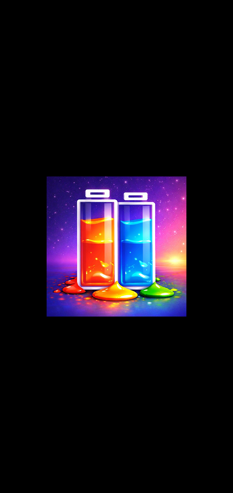
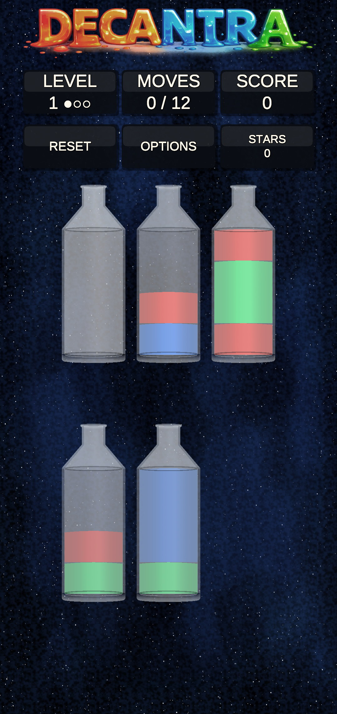
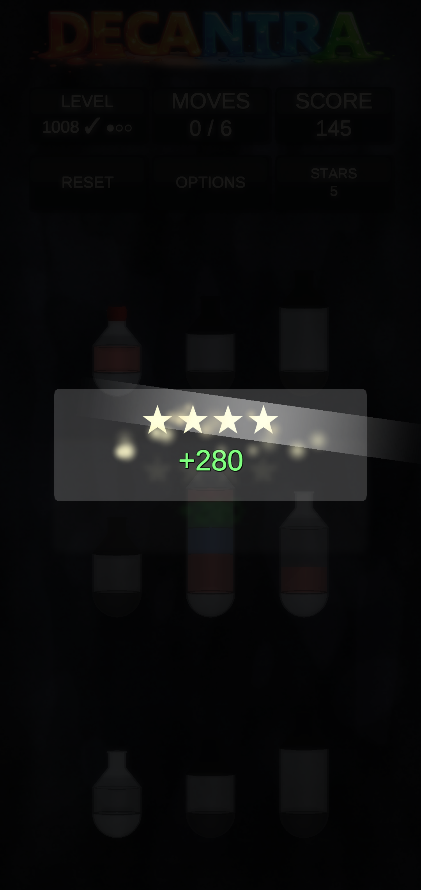
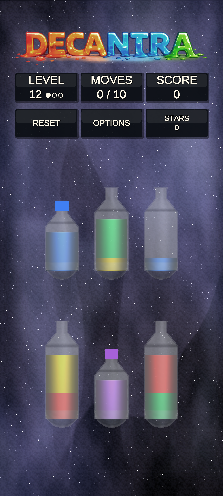
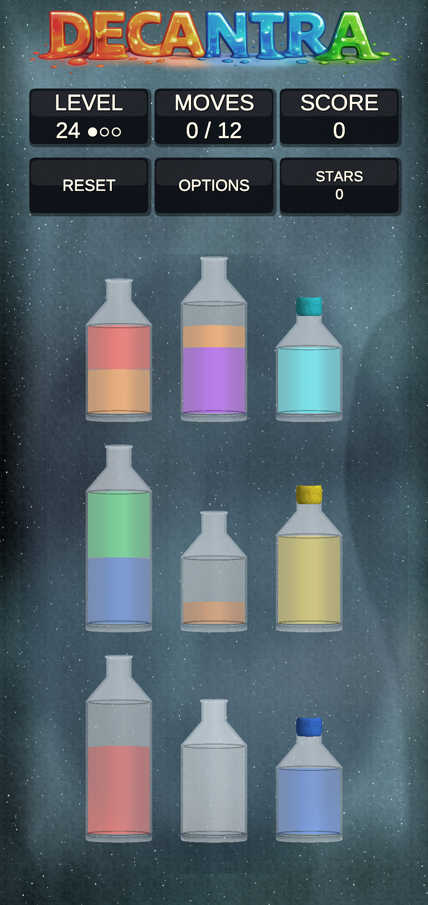
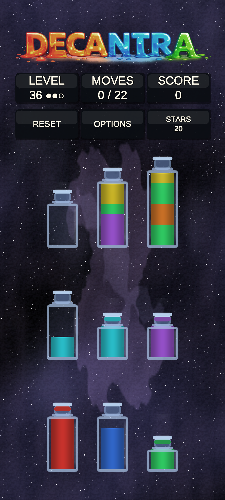
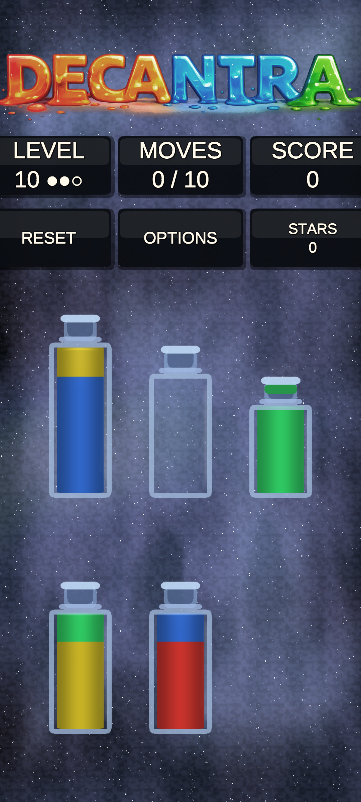
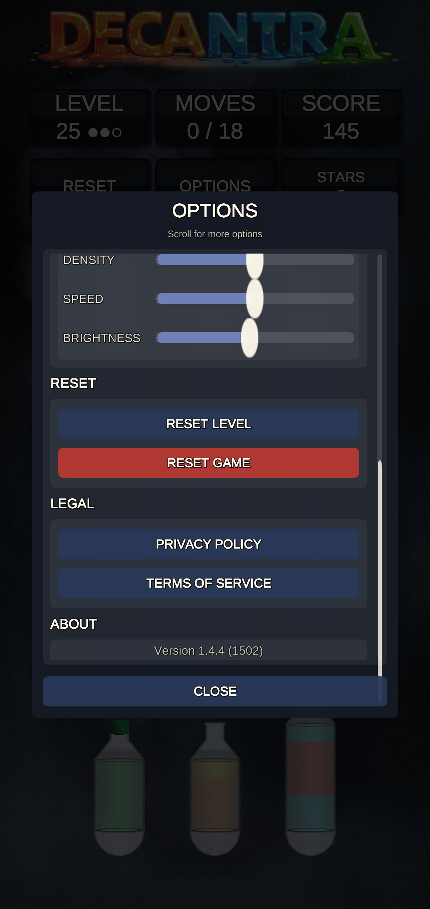
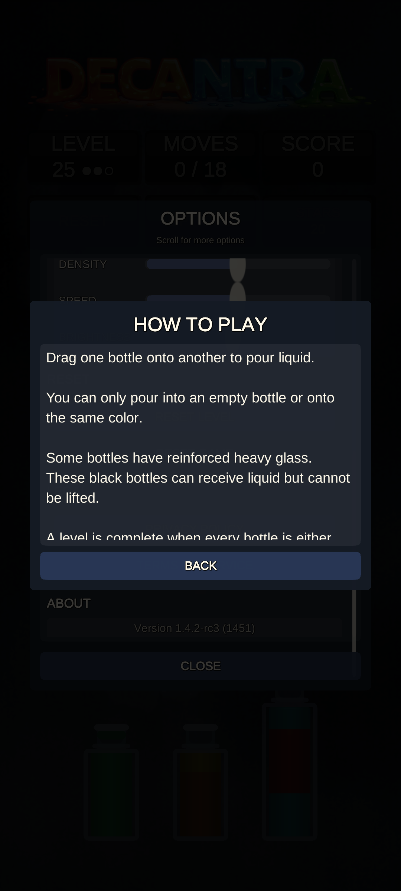

# Decantra

Bottle-sorting puzzle game for Android built with Unity.

## How to Play

- Drag one bottle onto another to pour liquid.
- You can only pour into an empty bottle or onto the same color.
- Some bottles are black bottles with heavier, darker glass. They can receive liquid but cannot be lifted.
- A level is complete when all bottles are either empty or contain exactly one color.

## Features

- Infinite, procedurally generated puzzles.
- Move budgets that reward efficient play.
- Varied bottle sizes and anchored black bottles for added challenge.
- Smooth, mobile-first controls.
- Configurable starfield effect.

## Screenshots

<table>
  <tr>
    <td></td>
    <td></td>
    <td></td>
  </tr>
  <tr>
    <td></td>
    <td></td>
    <td></td>
  </tr>
  <tr>
    <td></td>
    <td></td>
    <td></td>
  </tr>
</table>

## Installation

1. Download the APK from the latest GitHub release (`decantra-<version>.apk`).
2. Open the downloaded file on your Android device (Files app or notification).
3. If prompted, allow installs from unknown sources for the browser/files app.
4. Tap Install to finish.

## Further Information

- Developer info and build instructions: [doc/developer.md](doc/developer.md)
- [LICENSE](LICENSE)
