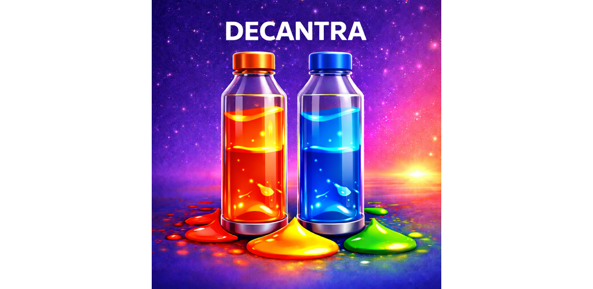
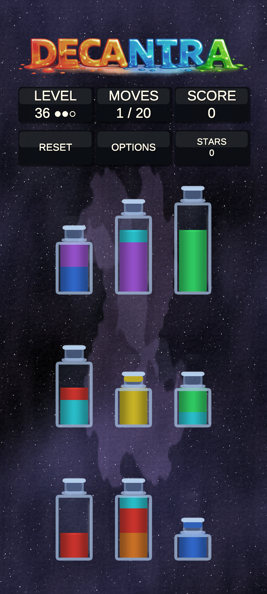
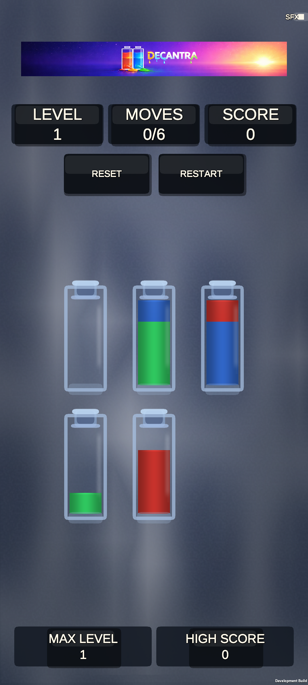
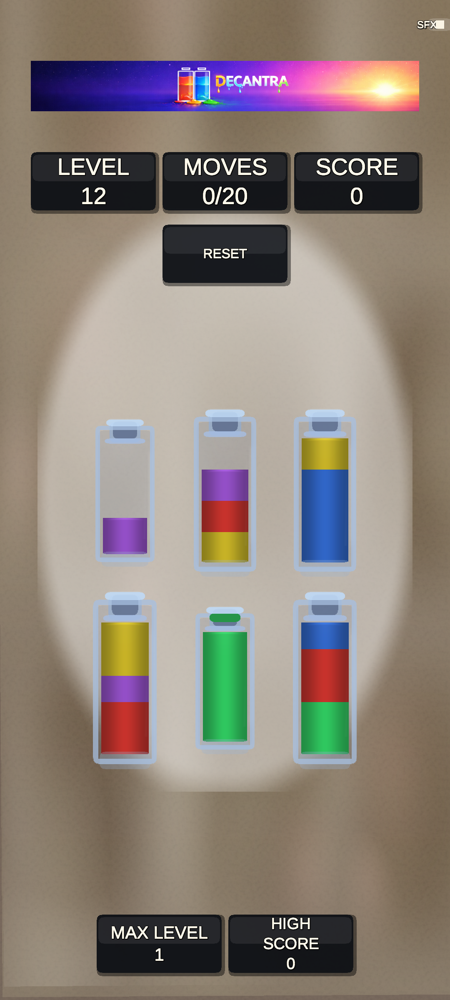

# Decantra

Decantra is a mobile-first bottle-sorting puzzle game. Levels are endlessly generated so every run stays fresh, and each level gives you a move budget to beat.

Sort liquids by color using a small set of rules and complete each level by leaving bottles either empty or single-colored.

## How to Play

- Drag one bottle onto another to pour liquid.
- You can only pour onto the same color or into an empty segment.
- A level is complete when all bottles are either empty or contain exactly one color.
- Some bottles are anchored (dark base): they can receive liquid but cannot be lifted.
- Bottles may have different capacity, and later levels add more colors and constraints.

## Features

- Infinite, procedurally generated puzzles.
- Move budgets that reward efficient play.
- Varied bottle sizes and anchored sink bottles for added challenge.
- Smooth, mobile-first controls designed for short sessions.

## Screenshots

<table>
  <tr>
    <td></td>
    <td></td>
  </tr>
  <tr>
    <td></td>
    <td></td>
  </tr>
</table>

## Installation

1. Download the APK from the latest GitHub release (`decantra-<version>.apk` for normal installs; use `decantra-<version>-debug.apk` only if you need a debug build).
2. Open the downloaded file on your Android device (Files app or notification).
3. If prompted, allow installs from unknown sources for the browser/files app.
4. Tap Install to finish.

## Further Information

- Developer info and build instructions: [doc/developer.md](doc/developer.md)
- [LICENSE](LICENSE)
