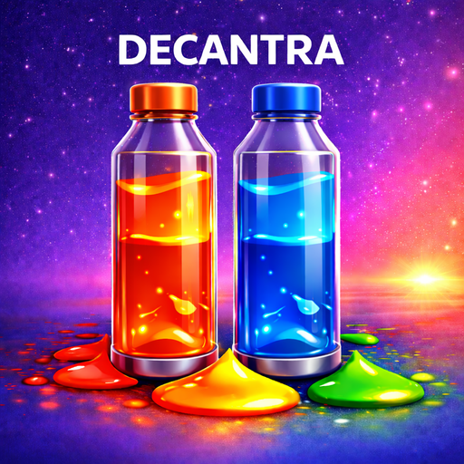
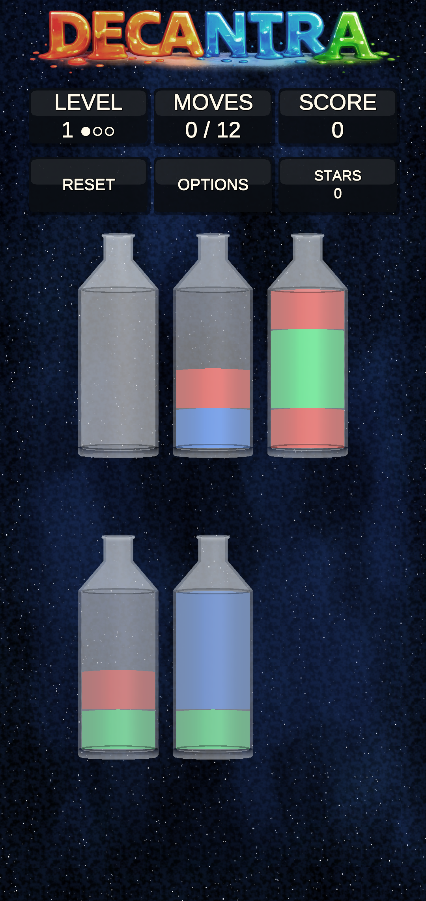
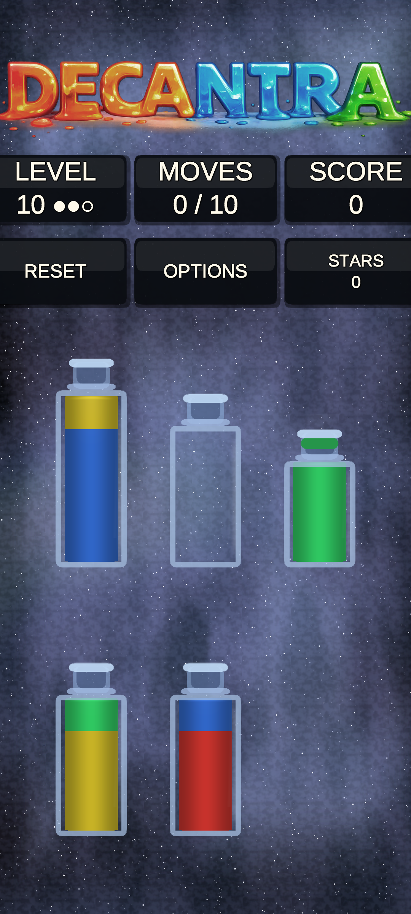
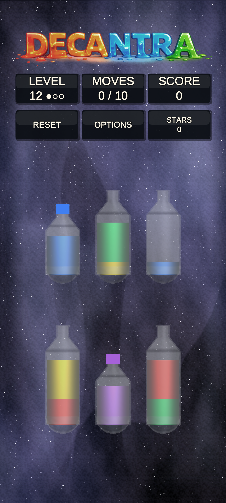
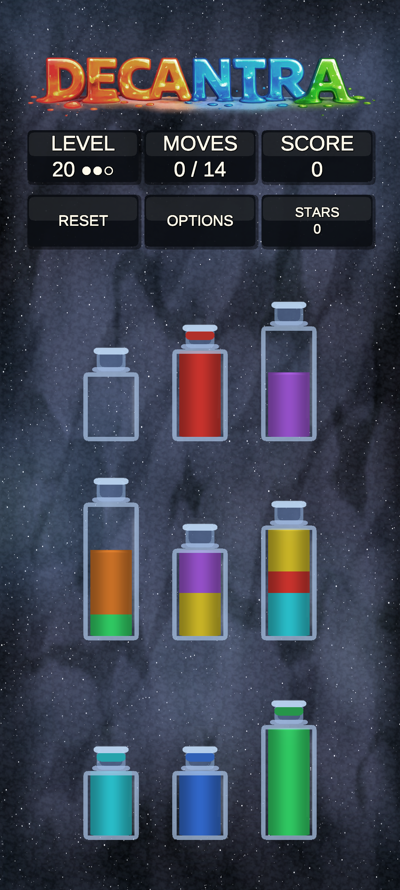
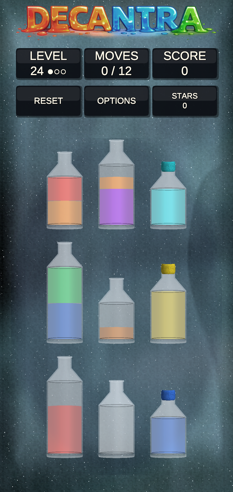
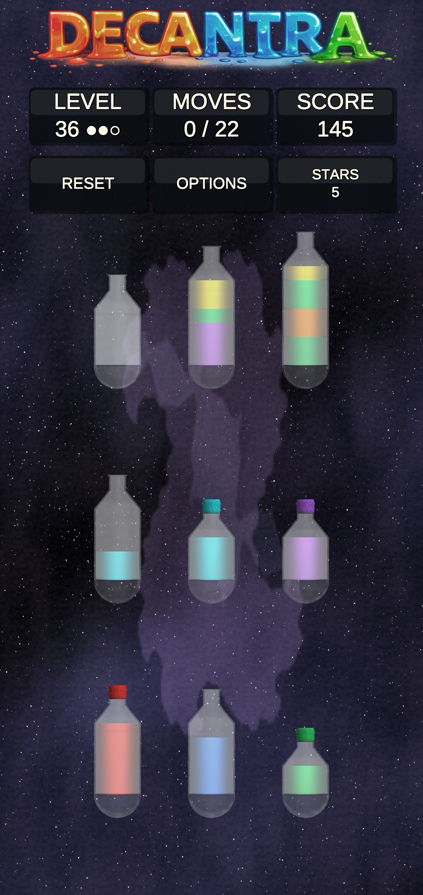

# Decantra

A bottle-sorting puzzle game with procedurally generated levels that never run out. Available on Android, iOS, and Web.

## How to Play

Sort the colored liquids by pouring from one bottle to another until each bottle holds a single color.

- **Pour** by dragging one bottle onto another.
- You can only pour onto **the same color** or into an **empty bottle**.
- **Black bottles** (sinks) accept liquid but can't be picked up - plan around them.
- A level is solved when every non-empty bottle contains exactly one color.

Early levels ease you in. Later levels introduce more colors, varying bottle sizes, and multiple sinks that demand careful sequencing. Every level is procedurally generated, so there's always a fresh puzzle waiting.

<table>
  <tr>
    <td></td>
    <td></td>
    <td></td>
  </tr>
  <tr>
    <td></td>
    <td></td>
    <td></td>
  </tr>
</table>

## Play Now

The fastest way to try Decantra is in your browser - no install required:

**[Play Decantra in your browser](https://chrisgleissner.github.io/decantra/webgl/)**

### Android

1. Grab the latest APK from [Releases](https://github.com/chrisgleissner/decantra/releases) (`decantra-<version>-android.apk`).
2. Open it on your device and allow installs from unknown sources if prompted.
3. Tap **Install** and you're in.

### iOS

1. Download the latest IPA from [Releases](https://github.com/chrisgleissner/decantra/releases) (`decantra-<version>-ios.ipa`).
2. Install via [SideStore](https://docs.sidestore.io/) (**My Apps → + → select the IPA**).
3. Launch and play.

## Features

- **Endless levels** - procedural generation means no two puzzles are alike and you never hit a dead end.
- **Increasing difficulty** - more colors, different bottle capacities, and sink bottles that constrain your options.
- **Three platforms** - Android, iOS, and Web from a single Unity codebase.

## License

Licensed under GPL v2. See [LICENSE](LICENSE) for details.
