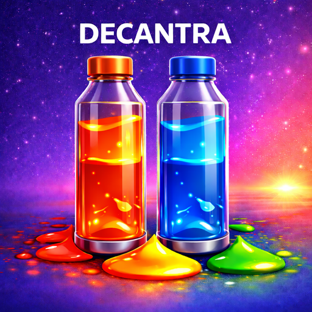

# Decantra

Decantra is a mobile-first bottle-sorting puzzle game built in Unity.

## What it does

- Solve increasingly challenging bottle-sorting levels.
- Drag one bottle onto another to pour matching colors.
- Complete levels by sorting each bottle to a single color or empty.
- Encounter varied bottle capacities and constraints.

## Support

- Email: [apps@gleissner.uk](mailto:apps@gleissner.uk)
- Issues: [github.com/chrisgleissner/decantra/issues](https://github.com/chrisgleissner/decantra/issues)

## Privacy

Read the privacy policy here: [Privacy Policy](privacy-policy.md)

## Development

- Procedural background system: [doc/procedural-background-spec.md](../doc/procedural-background-spec.md)
